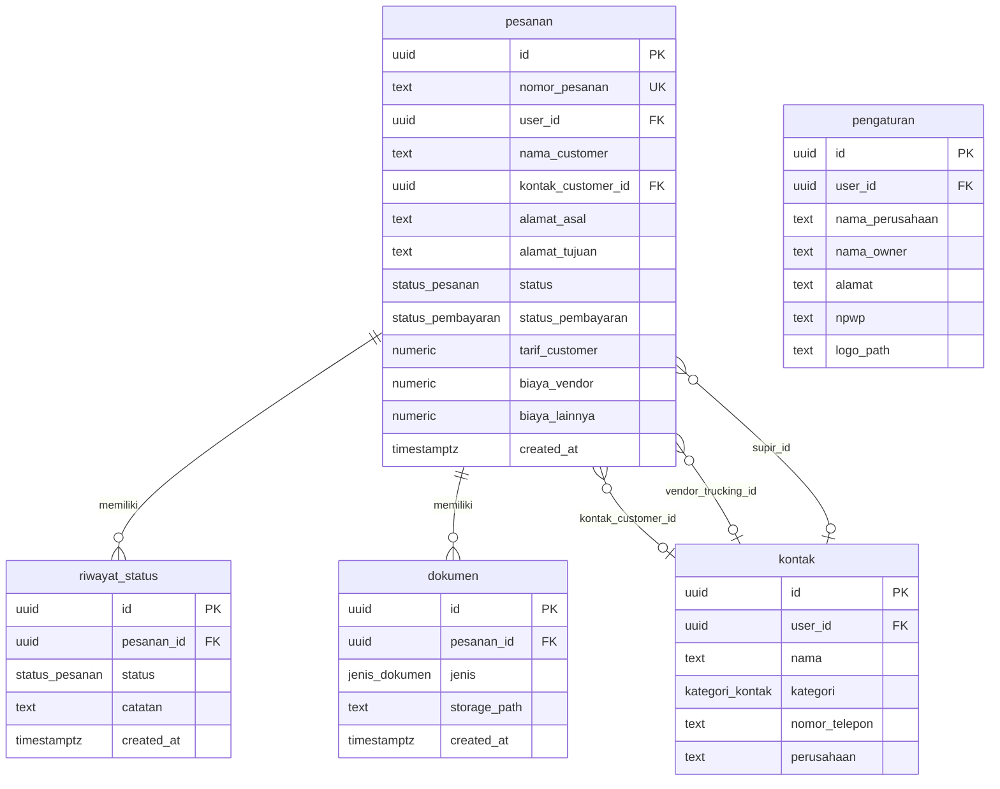

# Technical Specification — DCN OpsHub

Dokumen ini adalah cetak biru teknis sebelum menulis kode. Semua keputusan
di sini merujuk ke `docs/brief.md`, `docs/sitemap.md`, `docs/content.md`,
`.agents/rules/design-system.md`, dan `.agents/rules/tech-stack.md`.

---

## 1. Ringkasan Arsitektur

### 1.1 Halaman (App Router)

| Route | Halaman | Deskripsi |
|---|---|---|
| `/login` | Login | Email + password sederhana (Supabase Auth) |
| `/(dashboard)` | Layout | Wrapper dengan BottomNav + Header, proteksi auth |
| `/(dashboard)/page.tsx` | Beranda | Sapaan dinamis, stat cards, Perlu Tindakan, Pesanan Terbaru, FAB Buat Pesanan |
| `/(dashboard)/pesanan/page.tsx` | Daftar Pesanan | Filter status (chips), search, list kartu pesanan, empty state |
| `/(dashboard)/pesanan/baru/page.tsx` | Buat Pesanan Baru | Form satu halaman: Pengirim/Penerima, Muatan, Transportasi, Biaya Awal |
| `/(dashboard)/pesanan/[id]/page.tsx` | Detail Pesanan | 4 tab: Tracking, Dokumen, Keuangan, Kontak. Tombol aksi dinamis sticky |
| `/(dashboard)/kontak/page.tsx` | Daftar Kontak | Filter kategori, kartu kontak, tombol Telepon/WA, Tambah Kontak |
| `/(dashboard)/pengaturan/page.tsx` | Pengaturan | Profil perusahaan (nama, alamat, NPWP, logo), Bantuan (FAQ), Keluar |

### 1.2 Komponen Utama

```
components/
  layout/
    BottomNav.tsx          → 4 item: Beranda, Pesanan, Kontak, Lainnya
    Header.tsx             → Judul halaman + tombol back (kontekstual)
    AppShell.tsx           → Wrapper layout (Header + content + BottomNav)

  shipment/
    ShipmentCard.tsx       → Kartu pesanan (daftar & beranda)
    StatusBadge.tsx        → Pill badge warna sesuai status
    StatusStepper.tsx      → Timeline vertikal milestone pengiriman
    DynamicActionButton.tsx → Tombol aksi utama yang berubah per status
    EmptyState.tsx         → Ilustrasi + teks saat belum ada pesanan

  contact/
    ContactCard.tsx        → Kartu kontak dengan tombol Telepon & WA
    ContactQuickAdd.tsx    → Modal/sheet tambah kontak cepat

  document/
    DocumentCard.tsx       → Kartu per jenis dokumen (status + aksi)
    DocumentPreview.tsx    → Preview/download PDF

  finance/
    FinanceSummary.tsx     → Rincian biaya, margin, status pembayaran

  ui/
    (shadcn restyle)       → Button, Input, Dialog, Tabs, Toast, dll
```

### 1.3 Library / Template PDF

```
lib/
  documents/
    SuratJalan.tsx         → Template PDF Surat Jalan
    Invoice.tsx            → Template PDF Invoice
    CostSheet.tsx          → Template PDF Rincian Biaya
    POD.tsx                → Template PDF Bukti Serah Terima

  supabase/
    client.ts              → Supabase browser client (createBrowserClient)
    server.ts              → Supabase server client (createServerClient via cookies)
    admin.ts               → Supabase admin/service role (hanya di Server Actions)

  validations/
    pesanan.ts             → Zod schema form Buat Pesanan Baru
    kontak.ts              → Zod schema form Tambah Kontak
    pengaturan.ts          → Zod schema form Pengaturan
```

---

## 2. Skema Database Supabase

### 2.1 Enum Types

```sql
-- Status pengiriman (urutan sesuai milestone resmi perusahaan)
CREATE TYPE status_pesanan AS ENUM (
  'booking',
  'pickup',
  'berangkat',
  'dalam_perjalanan',
  'tiba',
  'terkirim',
  'tertunda',
  'selesai'
);

-- Status pembayaran (terpisah dari status pengiriman)
CREATE TYPE status_pembayaran AS ENUM (
  'belum_ditagih',
  'menunggu_pembayaran',
  'lunas'
);

-- Jenis armada
CREATE TYPE jenis_armada AS ENUM (
  'cdd',
  'fuso',
  'wingbox',
  'trailer',
  'lowbed',
  'lainnya'
);

-- Kategori kontak
CREATE TYPE kategori_kontak AS ENUM (
  'customer',
  'vendor_trucking',
  'supir',
  'internal'
);

-- Jenis dokumen
CREATE TYPE jenis_dokumen AS ENUM (
  'surat_jalan',
  'invoice',
  'cost_sheet',
  'pod'
);
```

### 2.2 Tabel: `pesanan`

Tabel utama — setiap baris = 1 pesanan/shipment.

| Kolom | Tipe | Nullable | Default | Keterangan |
|---|---|---|---|---|
| `id` | `uuid` | NO | `gen_random_uuid()` | PK |
| `nomor_pesanan` | `text` | NO | — | Unique, format `DCN-YYYYMM-XXXX` (auto-generated) |
| `user_id` | `uuid` | NO | — | FK → `auth.users.id` (pemilik/pembuat pesanan) |
| `nama_customer` | `text` | NO | — | Nama pelanggan |
| `kontak_customer_id` | `uuid` | YES | — | FK → `kontak.id` (opsional, kalau customer sudah ada di daftar kontak) |
| `alamat_asal` | `text` | NO | — | Alamat pickup |
| `alamat_tujuan` | `text` | NO | — | Alamat tujuan pengiriman |
| `jenis_barang` | `text` | YES | — | Deskripsi barang |
| `berat` | `numeric(10,2)` | YES | — | Berat dalam kg |
| `volume` | `numeric(10,2)` | YES | — | Volume dalam m³ |
| `jumlah_koli` | `integer` | YES | — | Jumlah koli/colly |
| `catatan_muatan` | `text` | YES | — | Catatan khusus (pecah belah, alat berat, dll) |
| `jenis_armada` | `jenis_armada` | YES | — | Tipe kendaraan |
| `vendor_trucking_id` | `uuid` | YES | — | FK → `kontak.id` (vendor trucking) |
| `supir_id` | `uuid` | YES | — | FK → `kontak.id` (supir yang ditugaskan) |
| `plat_nomor` | `text` | YES | — | Plat nomor kendaraan |
| `estimasi_berangkat` | `date` | YES | — | Tanggal estimasi keberangkatan |
| `tarif_customer` | `numeric(15,2)` | YES | `0` | Tarif yang dikenakan ke customer |
| `biaya_vendor` | `numeric(15,2)` | YES | `0` | Biaya vendor/trucking |
| `biaya_lainnya` | `numeric(15,2)` | YES | `0` | Biaya tambahan lain-lain |
| `status` | `status_pesanan` | NO | `'booking'` | Status pengiriman saat ini |
| `status_pembayaran` | `status_pembayaran` | NO | `'belum_ditagih'` | Status pembayaran |
| `created_at` | `timestamptz` | NO | `now()` | Tanggal dibuat |
| `updated_at` | `timestamptz` | NO | `now()` | Tanggal terakhir diubah |

**Indexes:** `nomor_pesanan` (unique), `status`, `user_id`, `created_at DESC`.

**Generated column (virtual):**
- `margin` = `tarif_customer - biaya_vendor - biaya_lainnya` (dihitung di
  query/aplikasi, bukan stored — supaya selalu akurat).

### 2.3 Tabel: `riwayat_status`

Log setiap perubahan status pesanan — sumber data untuk stepper/timeline.

| Kolom | Tipe | Nullable | Default | Keterangan |
|---|---|---|---|---|
| `id` | `uuid` | NO | `gen_random_uuid()` | PK |
| `pesanan_id` | `uuid` | NO | — | FK → `pesanan.id` ON DELETE CASCADE |
| `status` | `status_pesanan` | NO | — | Status yang dicapai |
| `catatan` | `text` | YES | — | Catatan singkat (mis. "Muat di gudang customer") |
| `created_at` | `timestamptz` | NO | `now()` | Waktu status tercapai |

**Indexes:** `pesanan_id` + `created_at`.

### 2.4 Tabel: `kontak`

Daftar kontak global — customer, vendor trucking, supir, internal.

| Kolom | Tipe | Nullable | Default | Keterangan |
|---|---|---|---|---|
| `id` | `uuid` | NO | `gen_random_uuid()` | PK |
| `user_id` | `uuid` | NO | — | FK → `auth.users.id` |
| `nama` | `text` | NO | — | Nama kontak |
| `kategori` | `kategori_kontak` | NO | — | Customer / Vendor Trucking / Supir / Internal |
| `nomor_telepon` | `text` | NO | — | Nomor WA/telepon |
| `perusahaan` | `text` | YES | — | Nama perusahaan (untuk vendor/customer) |
| `catatan` | `text` | YES | — | Catatan tambahan |
| `created_at` | `timestamptz` | NO | `now()` | Tanggal dibuat |
| `updated_at` | `timestamptz` | NO | `now()` | Tanggal diubah |

**Indexes:** `kategori`, `user_id`.

### 2.5 Tabel: `dokumen`

Metadata dokumen PDF yang sudah di-generate, file disimpan di Supabase Storage.

| Kolom | Tipe | Nullable | Default | Keterangan |
|---|---|---|---|---|
| `id` | `uuid` | NO | `gen_random_uuid()` | PK |
| `pesanan_id` | `uuid` | NO | — | FK → `pesanan.id` ON DELETE CASCADE |
| `jenis` | `jenis_dokumen` | NO | — | Tipe dokumen |
| `nama_file` | `text` | NO | — | Nama file di Storage |
| `storage_path` | `text` | NO | — | Path lengkap di Supabase Storage bucket |
| `created_at` | `timestamptz` | NO | `now()` | Tanggal di-generate |

**Constraint:** Unique(`pesanan_id`, `jenis`) — 1 dokumen per jenis per pesanan.

### 2.6 Tabel: `pengaturan`

Data profil perusahaan — dipakai di kop semua dokumen PDF dan sapaan beranda.

| Kolom | Tipe | Nullable | Default | Keterangan |
|---|---|---|---|---|
| `id` | `uuid` | NO | `gen_random_uuid()` | PK |
| `user_id` | `uuid` | NO | — | FK → `auth.users.id` (unique — 1 row per user) |
| `nama_perusahaan` | `text` | YES | `'PT Daff Cargo Nusantara'` | Nama perusahaan |
| `alamat` | `text` | YES | — | Alamat kantor |
| `npwp` | `text` | YES | — | NPWP (opsional) |
| `logo_path` | `text` | YES | — | Path logo di Supabase Storage |
| `nama_owner` | `text` | YES | — | Nama pemilik (untuk sapaan di Beranda) |
| `updated_at` | `timestamptz` | NO | `now()` | Tanggal diubah |

**Constraint:** Unique(`user_id`).

### 2.7 Diagram Relasi



### 2.8 Supabase Storage

| Bucket | Akses | Isi |
|---|---|---|
| `documents` | Private (hanya via Server Actions) | File PDF hasil generate (Surat Jalan, Invoice, Cost Sheet, POD) |
| `assets` | Private | Logo perusahaan, foto POD |

### 2.9 Row Level Security (RLS)

Semua tabel mengaktifkan RLS. Karena single-user, policy-nya sederhana:

```sql
-- Contoh untuk tabel pesanan (pola sama untuk semua tabel)
ALTER TABLE pesanan ENABLE ROW LEVEL SECURITY;

CREATE POLICY "user_owns_pesanan" ON pesanan
  FOR ALL
  USING (auth.uid() = user_id)
  WITH CHECK (auth.uid() = user_id);
```

---

## 3. Daftar Server Actions

Semua mutasi data melalui Server Actions (bukan API routes). Dibagi per domain:

### 3.1 Pesanan

| Fungsi | Tujuan |
|---|---|
| `createPesanan(formData)` | Validasi dengan Zod, generate `nomor_pesanan`, insert ke tabel `pesanan` + insert status awal `booking` ke `riwayat_status` |
| `updateStatusPesanan(pesananId, newStatus, catatan?)` | Update kolom `status` di `pesanan`, insert row baru ke `riwayat_status` dengan timestamp |
| `updatePesanan(pesananId, formData)` | Update data pesanan (edit muatan, biaya, dll) |

### 3.2 Keuangan / Pembayaran

| Fungsi | Tujuan |
|---|---|
| `updateStatusPembayaran(pesananId, newStatus)` | Update `status_pembayaran` di tabel `pesanan` (belum_ditagih → menunggu_pembayaran → lunas) |
| `updateBiaya(pesananId, tarif, biayaVendor, biayaLainnya)` | Update kolom-kolom biaya di `pesanan` |

### 3.3 Dokumen

| Fungsi | Tujuan |
|---|---|
| `generateDokumen(pesananId, jenisDokumen, extraData?)` | Render PDF via `@react-pdf/renderer`, upload ke Supabase Storage, insert metadata ke tabel `dokumen`. `extraData` untuk field tambahan (mis. nama supir/plat kalau belum ada) |
| `deleteDokumen(dokumenId)` | Hapus file dari Storage + hapus row dari tabel `dokumen` |

### 3.4 Kontak

| Fungsi | Tujuan |
|---|---|
| `createKontak(formData)` | Validasi Zod, insert ke tabel `kontak` |
| `updateKontak(kontakId, formData)` | Update data kontak |
| `deleteKontak(kontakId)` | Hapus kontak (soft-check: jangan hapus kalau masih terhubung ke pesanan aktif) |

### 3.5 Pengaturan

| Fungsi | Tujuan |
|---|---|
| `updatePengaturan(formData)` | Upsert ke tabel `pengaturan` (insert kalau belum ada, update kalau sudah) |
| `uploadLogo(file)` | Upload file logo ke Storage bucket `assets`, update `logo_path` di `pengaturan` |

### 3.6 Auth

| Fungsi | Tujuan |
|---|---|
| `login(email, password)` | Sign in via Supabase Auth |
| `logout()` | Sign out, redirect ke `/login` |

### 3.7 Dashboard Queries (Server Components)

Ini bukan Server Actions (bukan mutasi), tapi query yang dijalankan di
Server Components:

| Fungsi | Tujuan |
|---|---|
| `getPesananAktif()` | Ambil pesanan dengan status selain `selesai`, untuk stat card "Sedang Berjalan" |
| `getPesananPerluPerhatian()` | Ambil pesanan dengan status `tertunda` atau yang sudah lama tidak update, untuk stat card "Perlu Perhatian" |
| `getPesananTerbaru(limit)` | Ambil N pesanan terakhir berdasarkan `created_at` |
| `getPesananById(id)` | Ambil detail pesanan + riwayat_status + dokumen + kontak terkait |
| `getKontakByKategori(kategori?)` | Ambil daftar kontak, opsional filter per kategori |
| `getPengaturan()` | Ambil data profil perusahaan |
| `getDokumenByPesanan(pesananId)` | Ambil daftar dokumen yang sudah di-generate untuk pesanan tertentu |

---

## 4. Urutan Implementasi

Urutan ini mengikuti logika teknis (dependensi data model duluan) sesuai
panduan di `execution-prompts.md`:

| Fase | Nama | Scope |
|---|---|---|
| **0** | Technical Specification | ✅ Dokumen ini |
| **1** | Setup project & fondasi | Next.js + Tailwind (token) + Supabase (koneksi + tabel) + Auth + layout dasar (BottomNav, Header) — belum ada halaman fungsional |
| **2** | Buat Pesanan Baru | Form lengkap + validasi Zod + Server Action `createPesanan` + toast sukses |
| **3** | Daftar Pesanan | Filter chips + search + ShipmentCard + empty state — data dari tabel pesanan |
| **4** | Beranda (Dashboard) | Sapaan dinamis + stat cards (query real) + Perlu Tindakan + Pesanan Terbaru + FAB |
| **5** | Detail Pesanan: Tab Tracking | StatusStepper + DynamicActionButton (update status real) + tab placeholder |
| **6** | Detail Pesanan: Tab Dokumen | 4 template PDF + generate + upload Storage + status kartu dokumen + share WA |
| **7** | Detail Pesanan: Tab Keuangan | Rincian biaya + margin otomatis + badge pembayaran + tombol Buat Invoice / Tandai Lunas |
| **8** | Detail Pesanan: Tab Kontak | Kontak kontekstual berubah per status + tombol Telepon/WA |
| **9** | Kontak (halaman global) | CRUD kontak + filter kategori + quick-add dari form pesanan |
| **10** | Pengaturan | Profil perusahaan + hubungkan ke kop dokumen & sapaan Beranda + FAQ + Keluar |
| **11** | PWA + Polish akhir | Serwist (manifest + service worker) + mobile viewport check + full user flow test |

---

## 5. Keputusan Teknis Tambahan

### 5.1 Format Nomor Pesanan

`DCN-YYYYMM-XXXX` — contoh: `DCN-202608-0001`.

Cara generate:
- Ambil count pesanan bulan ini + 1
- Pad 4 digit
- Unique constraint di database sebagai safety net

### 5.2 Timezone

Semua timestamp disimpan sebagai `timestamptz` (UTC di database). Di UI,
tampilkan dalam zona waktu WIB (`Asia/Jakarta`) karena operasional
perusahaan ada di Indonesia.

### 5.3 Status Transition Rules

Transisi status mengikuti alur linear yang sudah ditetapkan di
`docs/brief.md`:

```
booking → pickup → berangkat → dalam_perjalanan → tiba → terkirim → selesai
                                                                ↗
Status "tertunda" bisa diterapkan dari status mana saja (kecuali selesai)
dan bisa dikembalikan ke status sebelumnya.
```

Validasi transisi dilakukan di Server Action `updateStatusPesanan` — tidak
boleh loncat status (mis. dari `booking` langsung ke `terkirim`).

### 5.4 Margin

`margin = tarif_customer - biaya_vendor - biaya_lainnya`

Dihitung di level aplikasi (bukan generated column di Postgres) karena
lebih fleksibel dan mudah ditampilkan di UI tanpa query tambahan.

### 5.5 Kontak Kontekstual di Detail Pesanan

Tab Kontak menampilkan kontak berbeda berdasarkan `status` pesanan saat
ini (sesuai `docs/content.md`):

| Status pesanan | Kontak yang ditampilkan |
|---|---|
| `booking`, `pickup` | Vendor Trucking + Supir |
| `dalam_perjalanan`, `tiba` | Supir + Customer (tujuan) |
| `terkirim` + belum lunas | Customer (PIC pembayaran) + Finance internal |

Kontak diambil dari:
- `pesanan.vendor_trucking_id` → join ke `kontak`
- `pesanan.supir_id` → join ke `kontak`
- `pesanan.kontak_customer_id` → join ke `kontak`
- Kontak internal → filter `kontak.kategori = 'internal'`
